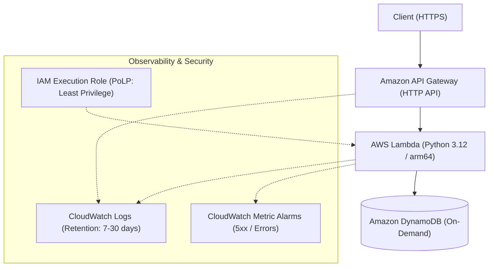

# Serverless Dual-IaC Blueprint ⚡

> **Terraform × AWS CDK 二刀流で切り拓く、堅牢・高速な完全サーバーレスAPI基盤**

本プロジェクトは、Amazon API Gateway (HTTP API)、AWS Lambda (arm64 / Graviton)、および Amazon DynamoDB (オンデマンド) で構成される堅牢な完全サーバーレスRESTful API基盤です。

最大の特徴は、**「Terraform (HCL)」と「AWS CDK (TypeScript)」の双方で同一のインフラ仕様を完全再現・比較検証できる二刀流アーキテクチャ**を採用している点です。宣言型アプローチとオブジェクト指向アプローチ双方の長所を体感し、実運用におけるIaC選定のベストプラクティスを提供します。

---

## 🏛 アーキテクチャ構成図



---

## ✨ 主な特徴とハイライト

1. **究極のコスト効率と高スループット**
   - 常駐型リソース（NAT Gateway、ALB、EC2）を徹底排除し、待機コストゼロを実現。
   - Lambda には arm64 (Graviton) アーキテクチャを採用し、優れたプライスペフォーマンスを享受。
2. **本番対応の堅牢性とエンタープライズ品質**
   - DynamoDB のポイントインタイムリカバリ (PITR) および誤削除防止 (`DeletionProtection`) に対応（環境別に最適化）。
   - 最小権限の原則 (PoLP) に基づく粒度の細かな IAM ポリシー設計。
3. **二刀流 IaC (Terraform & AWS CDK)**
   - **Terraform**: 永続化データ層や変更頻度の低いステート管理に最適化された宣言的定義。
   - **AWS CDK**: ビジネスロジックと密結合するAPI・Lambdaレイヤーを高凝集に扱う型安全なコンストラクト。

---

## 📂 ディレクトリ構成

```text
.
├── terraform/                  # Terraform 実装
│   ├── modules/                # リソースモジュール (api_gateway, lambda, dynamodb)
│   └── environments/           # 環境別エントリポイント
│       ├── dev/                # 開発環境 (main.tf, terraform.tfvars)
│       └── prod/               # 本番環境 (main.tf, terraform.tfvars)
├── cdk/                        # AWS CDK (TypeScript) 実装
│   ├── bin/
│   │   └── app.ts              # CDK アプリエントリポイント
│   ├── lib/
│   │   └── serverless-stack.ts # スタック & コンストラクト定義
│   └── test/                   # インフラユニットテスト
└── README.md
```

---

## 🚀 デプロイ手順

### 1. Terraform での展開

```bash
cd terraform/environments/dev

# 初期化とプロビジョニング
terraform init
terraform plan
terraform apply
```

### 2. AWS CDK での展開

```bash
cd cdk

# 依存関係のインストール
npm install

# シンセサイズ & デプロイ
npx cdk synth
npx cdk deploy --context env=dev
```

---

## 🎬 キャスト & クレジット（AIアプリ工場劇場）

- **agent🔵 (企画・要件定義)**: ビジネス価値と技術検証を両立させる「二刀流サーバーレス」の要件策定
- **agent🍇 (アーキテクト・設計)**: 堅牢性・セキュリティ・可観測性を満たすハイブリッドIaCアーキテクチャの青写真設計
- **agent🍊 (実装・コード職人)**: 爆速かつ精緻な Terraform / CDK コードの実装とモジュール化
- **agent🟢 (QA・品質保証)**: 厳格な非機能要件テスト、セキュリティチェック、および品質の全量検証
- **agent🟡 (プロデューサー)**: 全体総括、リポジトリ最適化、および舞台統括